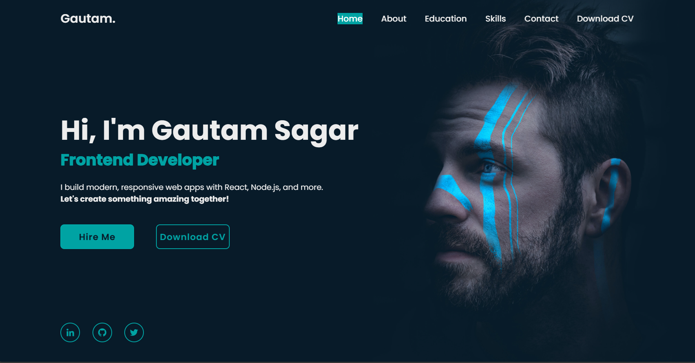

# 🚀 Gautam Sagar's Web3 Portfolio

Welcome to my *personal portfolio website* built with modern frontend technologies to showcase my skills, projects, and passion for Web3 development.

---

## 🌟 Features

- ⚛ Developed using *React.js* for a dynamic and fast UI  
- 📱 Fully *responsive design* compatible with all devices  
- 🎯 Interactive *live demos* of real projects  
- 💻 Clean, modular, and maintainable *codebase*  
- 🚀 Hosted on *Netlify* for blazing-fast performance  
- 📄 Downloadable *resume* & easy-to-use *contact form*  
- 🔗 Embracing *Web3 principles* & future-ready tech stack  

---

## 📸 Project Preview



Above: Homepage preview of my portfolio

---

## 🔧 Technologies Used

- React.js  
- JavaScript (ES6+)  
- HTML5 & CSS3  
- Netlify (Deployment)  

---

## 🚀 Live Demo

Explore the portfolio live here:  
[https://gautam-portfolio-web3.netlify.app/](https://gautam-portfolio-web3.netlify.app/)

---

## 💻 Run Locally

```bash
git clone https://github.com/gautamsagar/gautam-portfolio.git
cd gautam-portfolio
npm install
npm start


📬 Contact Me

Email: gateaspirant8650@gmail.com

Phone: +91 7900503595

LinkedIn: Gautam Sagar


---

Thank you for visiting! Let's connect and build amazing things together! ✨
